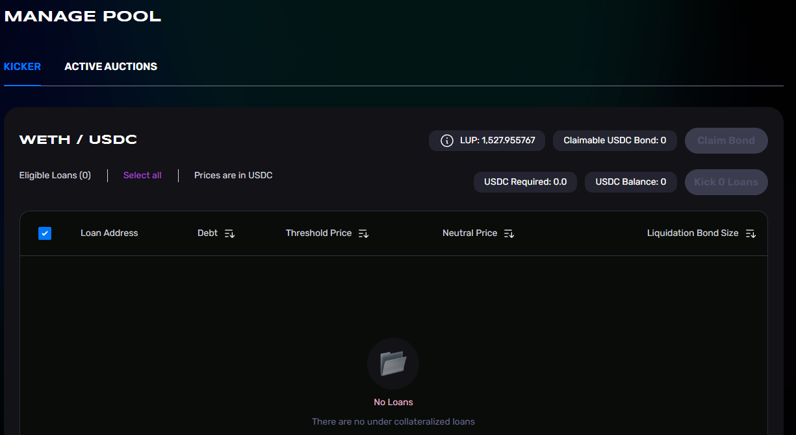

# 🕳 Liquidations

[What is a liquidation?](liquidations.md#what-is-a-liquidation)\
[Where can I access a UI for liquidations?](liquidations.md#where-can-i-access-a-ui-for-liquidations)\
[When does a liquidation happen?](liquidations.md#when-does-a-liquidation-happen)\
[What is the liquidation trigger price?](liquidations.md#what-is-the-liquidation-trigger-price)\
[Who triggers liquidations?](liquidations.md#who-triggers-liquidations)\
[What is required to trigger a liquidation?](liquidations.md#what-is-required-to-trigger-a-liquidation)\
[Where can I trigger liquidations?](liquidations.md#where-can-i-trigger-liquidations)\
[What is a liquidation bond?](liquidations.md#what-is-a-liquidation-bond)\
[Why is a liquidation bond needed?](liquidations.md#why-is-a-liquidation-bond-needed)\
[How much does the liquidation bond cost?](liquidations.md#how-much-does-the-liquidation-bond-cost)\
[How is a loan's liquidation price set?](liquidations.md#how-is-a-loans-liquidation-price-set)\
[How do I participate in liquidation auctions?](liquidations.md#how-do-i-participate-in-liquidation-auctions)\
[How does a liquidation auction work?](liquidations.md#how-does-a-liquidation-auction-work)\
[What if a liquidation auction clears below a loan's Threshold Price?](liquidations.md#what-if-a-liquidation-auction-clears-below-a-loans-threshold-price)\
[In NFT-collection pools, do liquidation auctions happen per single NFT?](liquidations.md#in-nft-collection-pools-do-liquidation-auctions-happen-per-single-nft)\
[In NFT-collection pools, how do group liquidations work?](liquidations.md#in-nft-collection-pools-how-do-group-liquidations-work)\

### What is a liquidation?

Liquidation is a process of selling off assets to pay off debts.\
\
In the context of loans, a liquidation occurs when collateral that was used to secure a loan is sold; proceeds from the sale of the collateral are used to repay the debt. \
\
Liquidation is a last resort for when a borrower is unable to repay a loan. Liquidations often include penalties. It is important for borrowers to understand the potential consequences of defaulting on a loan before they take out the loan.

### Where can I access a UI for liquidations?

1. Go to [https://ajnafi.com/](https://ajnafi.com/)
2. Click `Pool Details`\
   
3. Click `Manage Pool`

<figure><figcaption></figcaption></figure>

4.  Navigate and interact withh loans available to be liquidated.\

    <figure><figcaption></figcaption></figure>

### When does a liquidation happen?

A liquidation happens when the borrower fails to keep their loan in good standing.\
\
To determine whether a loan can be appropriately liquidated there are three important variables used by the system; the loan’s [_Threshold Price (TP)_](https://faqs.ajna.finance/getting-started/glossary#threshold-price-tp), the loan’s [_Neutral Price(NP)_](https://faqs.ajna.finance/getting-started/glossary#lowest-utilized-price-lup) and the pool’s [_Lowest Utilized Price (LUP)_](https://faqs.ajna.finance/getting-started/glossary#lowest-utilized-price-lup). \
\
TP is set by the borrower and is a loan’s debt x 1.04 divided by the collateral. \
NP is set at origination and when a loan is modified with respect to its debt or collateral and is usually some number above the TP. The NP acts as the effective liquidation price of the loan.\
LUP moves freely and is defined as the lowest collateral price bucket against which someone is actively borrowing.\
\
If a loan's TP crosses above the pool's LUP, then their position is eligible for liquidation. This is referred to as the _liquidation trigger price_. A loan may be profitable to liquidate, with regard to the [liquidation bond](https://faqs.ajna.finance/faqs/liquidations#what-is-a-liquidation-bond), when the price of the collateral crosses below the NP of a given loan.

### What is the liquidation trigger price?

The liquidation trigger price is the price at which a loan can be triggered for liquidation, though it may not necessarily be profitable to do so. When a loan's [_Threshold Price (TP)_](https://faqs.ajna.finance/getting-started/glossary#threshold-price-tp) crosses above the pool's [Lowest Utilized Price (LUP)](https://faqs.ajna.finance/getting-started/glossary#lowest-utilized-price-lup), their position is eligible for liquidation.\
\
It is profitable, through the liquidation bond mechanism, to liquidate a position when the price of its collateral crosses below the [Neutral Price(NP)](https://faqs.ajna.finance/getting-started/glossary#neutral-price-np).

### Who triggers liquidations?

Anyone can trigger a liquidation by posting a [liquidation bond](https://faqs.ajna.finance/faqs/liquidations#what-is-a-liquidation-bond) for the loan in question.

### What is required to trigger a liquidation?

The purchase of a [liquidation bond](https://faqs.ajna.finance/faqs/liquidations#what-is-a-liquidation-bond) is required to trigger liquidations.

### Where can I trigger liquidations?

1. Go to [https://ajnafi.com/](https://ajnafi.com/)
2. Click `Pool Details`\
   .png>)
3.  Click `Manage Pool`\

    <figure><figcaption></figcaption></figure>
4.  Navigate and interact with loans available to be liquidated.\

    <figure><figcaption></figcaption></figure>

### What is a liquidation bond?

A liquidation bond is effectively a bet on the outcome of a collateral sale. In the Ajna protocol, the purchase of a liquidation bond is required to liquidate a loan.

### Why is a liquidation bond needed?

This requirement creates a disincentive to liquidate loans that are sufficiently collateralized with respect to the collateral's market price and creates an incentive to liquidate loans that become under-collateralized with respect to their Neutral Prices.

### How much does the liquidation bond cost?

A bond is priced as a percentage of the debt that is being liquidated. It can range from 1% to 30%.\
\
See section _7.3.2 Sizing the Bond_ in the [whitepaper](https://www.ajna.finance/whitepaper) for full detail.

### When should a liquidation bond be posted?

It is profitable to post a liquidation bond when the sale of collateral is expected to clear below the neutral price of the liquidated loan.\
\
Consider the examples below:\
\
Bob sees Dave's loan is eligible for liquidation. The price of ETH is $1800, while the NP of the loan is $1830. Bob expects the collateral to be sold under $1830, accounting for the time the auction takes, and decides to post the bond and trigger the liquidation of the loan to earn a reward.\
\
Bob sees Dave's loan is eligible for liquidation. The price of ETH is $1850, while the NP of the loan is $1830. Bob expects the collateral to be sold above $1830 and decides not to start the liquidation despite its eligibility.

### How is a loan's liquidation price set?

In Ajna the [Neutral Price (NP)](https://faqs.ajna.finance/getting-started/glossary#neutral-price-np) acts as the liquidation price.

When a loan is initiated or modified (the first debt, additional debt drawn, or collateral is removed from the loan), the neutral price is set to `np = (debt/coll) * 1.04 * (1 + sqrt(2)/2)` or

&#x20;                        .png>)             \
\
where r is the current borrower rate of the pool. As time passes, the neutral price increases at the same rate as interest.\
\
Read more in section 7.3.1 of the [whitepaper.](https://www.ajna.finance/whitepaper)

### How do I participate in liquidation auctions?

There are two ways to participate. \
\
The first, as a loan "kicker". This actor posts liquidation bonds and kicks loans into liquidation. \
The second, as an auction bidder. This actor bids on collateral during liquidation auctions.\
\
Beginners could use the Ajna application to access this functionality while advanced actors can develop their own UIs or automations.

### How does a liquidation auction work?

Liquidation auctions are in dutch auction format where at the start of the auction the price per unit of collateral is very high and gradually becomes lower over time. In Ajna, liquidation auctions span a maximum of 72 hours. The collateral price starts at 256 times the [auction reference price](https://faqs.ajna.finance/getting-started/glossary#auction-reference-price) and exponentially decays towards 0 starting with 6 twenty minute halvings, followed by 6 two hour halvings, followed by hour halvings till the end of the 72 hour auction. Bidders may either use quote token or deposit in the pool to participate.

If a deposit is used to participate in the auction, that deposit is canceled and removed from the bucket. If there is collateral remaining in an auction after 72 hours have passed, any actor may settle the auction and claim the remaining collateral.\
\
For more details check out section 7.4 in the [Whitepaper](https://www.ajna.finance/whitepaper).

### What if a liquidation auction clears below a loan's Threshold Price?

If a liquidation fails to sell collateral at or above the threshold price, then the loan's left over debt gets deducted from the pool's [reserves](https://faqs.ajna.finance/faqs/reserve-auctions#what-are-reserves). If that is insufficient, then the debt is deducted from the quote token liquidity in the highest price buckets, diluting LPB holders in those buckets.

### In NFT-collection pools, do liquidation auctions happen per single NFT?

If a borrower’s position is backed by multiple NFTs, they will all go to auction simultaneously. If the position is backed by a single NFT, then only that NFT will go to auction.

### In NFT-collection pools, how do group liquidations work?

Similar to regular liquidations, once an auction is initiated the entire lot of collateral is available for purchase. Bidder have the option to place a bid on the entire lot or on a specific NFT during a group liquidation. If a bidder does not specify an NFT for their partial bid, a random one is selected (We haven't documented order in which they are taken.)

For `take`, taker provides an integer number of NFTs in `maxAmount_` argument. `bucketTake` can result in fragmenting NFTs in buckets.\
\

