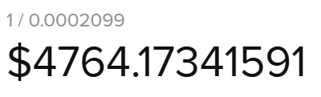

# Reserve Auctions

[What are reserves?](reserve-auctions.md#what-are-reserves)\
[What are claimable reserves?](reserve-auctions.md#what-are-claimable-reserves)\
[What is Net Interest Margin?](reserve-auctions.md#what-is-net-interest-margin)\
[What is a reserve auction?](reserve-auctions.md#what-is-a-reserve-auction)\
[When do reserve auctions occur?](reserve-auctions.md#when-do-reserve-auctions-occur)\
[Who triggers reserve auctions, is there an incentive?](reserve-auctions.md#who-triggers-reserve-auctions-is-there-an-incentive)\
[How do I participate in a reserve auction?](reserve-auctions.md#how-do-i-participate-in-a-reserve-auction)

### What are reserves?

Reserves are a balance of funds that are collected from Origination Fees, Net Interest Margin and Penalties. Each pool has a reserve, denominated in the pool's quote token.  Reserves act as backup funds for covering bad debt and are also used for buying and burning AJNA tokens through reserve auctions.

### What are claimable reserves?

For a comprehensive breakdown see section 9.1 in the whitepaper.\
\
Claimable reserves are a portion of a pool's reserves that are eligible to be claimed through a reserve auction.\

<figure><figcaption>
Formula to calculate a pool's claimable reserves
</figcaption></figure>

### What is Net Interest Margin?

Net Interest Margin(NIM) is a portion of the interest revenue that goes to the pool's reserves and is used to provide a liquidity cushion to lenders and absorb bad debt if some should occur. The NIM is approximately 10% of the interest rate revenue. &#x20;

### What is a reserve auction?

A reserve auction is a sale of claimable reserves for AJNA tokens through a dutch auction. The bidder receives quote tokens, while the protocol burns the AJNA.

### When do reserve auctions occur?

Reserve auctions occur when enough claimable reserves accumulate such that the person triggering the reserve auction makes more money than the transaction costs. There is a 1% of claimable reserves reward for triggering a reserve auction. Additionally, reserve auctions can occur at a maximum of once every two weeks per pool.

### Who triggers reserve auctions, is there an incentive?

Anyone can trigger a reserve auction and the reward for doing so is 1% of the claimable reserves.

### How do I participate in a reserve auction?

Through your interface of choice.
