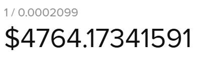

# 📖 Glossary

#### **Borrower Inflator (BI)**: &#x20;

The borrower inflator is used in the calculation of the neutral price, which can be used as a liquidation price. BI at a given time t to be the debt that a borrower would have incurred if they had borrowed a single quote token at the initiation of the contract and had never repaid or taken out any additional debt.

#### **Bond Factor (BF)**:&#x20;

Determines how much the liquidator must deposit for the bond. Bond factor multiplied by debt is how much the liquidator has to post to send the loan to auction, denominated in quote token.

<figure><figcaption></figcaption></figure>

#### **Bond Payment Factor (BPF)**:&#x20;

Is the factor of proportionality applied to the reward or penalty given to the liquidator based on each take amount and price when collateral liquidation auctions occur.

#### **Borrower Take Penalty**:&#x20;

A liquidation penalty applied when the collateral is taken during the auction.

<figure><figcaption></figcaption></figure>

#### **Challenge Stage**:&#x20;

The final part of each voting cycle is a seven day challenge stage to contest the payout configuration.

#### **Claimable Collateral**:&#x20;

Each price bucket may have claimable collateral which is exchangeable with quote tokens.

#### **Claimable Reserve Auction (CRA)**:&#x20;

Claimable reserves are set aside and can be auctioned off in a Dutch auction known as a CRA. Once the CRA is initiated, AJNA tokens may be used to bid in exchange for the claimable reserves, which are always denominated in a pool's quote token.

<figure><figcaption></figcaption></figure>

**Collateral Token (CT)**:&#x20;

Can be a regular fungible token (ERC20) or an NFT (ERC721). Borrowers deposit CT into the protocol to secure debt.

#### **Deposit**:&#x20;

When a lender provides quote token liquidity to a specified price bucket.

#### Deposit Fee:

All deposits incur a small fee equivalent to 8 hours of interest. The fee accrues on any new deposit, and any action which moves quote token down in price. The fee is not applied to actions which move quote token up in price.

#### **Dutch Auction**:

A type of auction where the price starts high and gradually decreases until a buyer agrees to make a purchase.

#### **Fenwick Tree**:&#x20;

A Fenwick tree or binary indexed tree is a data structure that can efficiently update elements and calculate prefix sums in a table of numbers. The Ajna Protocol uses a modified Fenwick Tree to hard code price buckets in Ajna pools.

#### **Funding Mechanism (FM)**:&#x20;

On a quarterly basis, a portion of the treasury is distributed to projects to facilitate the growth of Ajna. Teams and/or individuals submit proposals that are voted on by Ajna token holders and delegates.

#### **Funding Stage**:&#x20;

This is the second stage of a given voting cycle which uses a quadratic voting schema, lasts for 10 days, and involves up to 10 proposals.

#### **Highest Price Bucket (HPB)**:&#x20;

The highest-priced bucket which contains a deposit, not counting claimable collateral.

#### **Highest Threshold Price (HTP)**:&#x20;

The threshold price of the least collateralized loan. Lender deposits above the HTP earn interest. This is also known as the _Minimum Yield Price_**.**

#### **Kick**:&#x20;

A technical term synonymous with "initiate". When a loan is under-collateralized it qualifies to be “kicked”, which would initiate the sale of its collateral through a liquidation auction.

#### **Liquidation Auction**:&#x20;

A dutch auction which enables anyone to purchase portions of the collateral at a price that starts at _256 x reference\_price_ and decays towards 0 starting with 6 twenty minute halvings, followed by 6 two hour halvings, followed by hour halvings till the end of the 72 hour auction.

#### **Liquidation Auction Decay**:&#x20;

The speed at which a liquidation auction reduces the price of the collateral being offered. The decay moves towards 0 starting at _256 x reference\_price_ with 6 twenty minute halvings, followed by 6 two hour halvings, followed by hour halvings till the end of the 72 hour auction.

#### **Liquidation Bond**:

A bond paid in quote token, purchased by the initiator of a liquidation auction, that is awarded or penalized depending on the settling auction price relative to the loan's Neutral Price. The bond exists to prevent unfair liquidations.

#### **Liquidation Debt**:&#x20;

The total amount of debt being liquidated.

#### **Liquidity Provider Balance (LPB)**:&#x20;

A claimable token that represents a user's transferable share of a price bucket of a given pool.

#### **Lowest Utilized Price (LUP)**:&#x20;

The LUP is the lowest price bucket where there is a utilized deposit. It could also be seen as the price of the marginal (lowest priced and therefore least aggressive) lender matched with a borrower.

#### **Meaningful Actual Utilization (MAU)**:&#x20;

The ratio of the 12 hour moving average of debt to the 12 hour moving average of meaningful deposit, where meaningful deposit is the amount of deposit priced at or above the average threshold price of all loans, weighted by their debt.

#### **Meaningful Deposit (MD)**:&#x20;

Deposit above the debt-weighted average threshold price of loans.

#### **Minimum Borrow Size**:&#x20;

The minimum borrow size is 10% of the average loan size in a given pool. This is designed to deter small loans. These can be used to spam and grief the system.

#### **Net Interest Margin (NIM)**:&#x20;

NIM is a percentage of the borrow interest rate that accrues in reserves.

#### **Neutral Price (NP)**:&#x20;

The neutral price is essentially a loan's liquidation price. It is recomputed every time the borrower draws more debt, or removes collateral. The NP is used in the liquidation bond to reward or punish kickers of liquidations. It is calculated as:\

<figure><figcaption></figcaption></figure>

#### **Origination Fee**:&#x20;

Calculated as the greater of the current annualized borrower interest rate divided by 52 (one week of interest) or 5 bps multiplied by the loan’s debt.

#### **Pool**:&#x20;

A pool aggregates all lending and borrowing activity of a specific quote token as secured by a specific collateral token.

#### **Pool Collateralization**:&#x20;

A percentage that represents a pool's debt to collateral ratio. In Ajna this is calculated by the following formula:&#x20;

`Total Available Collateral / Total Encumbered Collateral = (Total Collateral)*LUP/Deb.`

#### **Price bucket**:&#x20;

Price buckets are hard-coded prices, discretized into 50 bps increments, at which users can deposit quote tokens or collateral. A price bucket can be freely traded against. In the worst case scenario, lenders would end up buying collateral at their chosen prices.

#### **Quote Token (QT)**:&#x20;

Must be an ERC20 token and is what lenders deposit into Price Buckets.

#### **Reference Price**:&#x20;

Is the max(HTP, NP) and is used in the liquidation auction starting price calculation.

#### **Reserves**:&#x20;

Origination fees, deposit penalties, and net interest margin on loans accumulate in pool reserves. Reserves are used to provide a liquidity cushion to lenders by absorbing bad debt if some should occur. Reserves are also used to buy and burn AJNA tokens.

#### **Screening Stage**:&#x20;

This is the first stage in a given voting cycle which uses a one-token-one-vote schema, lasts for 73 days, and involves an unlimited number of proposals. The top 10 move to the funding stage.

#### **Take Penalty Factor (TPF)**:&#x20;

The take penalty factor is used to compute the Take Penalty, which is the TPF times the amount of quote token used to purchase collateral.\

<figure><figcaption></figcaption></figure>

#### **Target Utilization (TU)**:&#x20;

The ratio of the 3.5 day EMA of system debt to 3.5 day EMA of LUP\*totalCollateral. This is able to be sampled / stored every half day (at the same time that interest rate updates become eligible) although gaps are OK. The lambda used for the EMAs is \

<figure><figcaption></figcaption></figure>

#### **Threshold Price (TP)**:&#x20;

The price at which the value of the collateral equals the value of the debt. By taking a loan’s debt and dividing it by the amount of collateral pledged, the loan’s threshold price, TP, can be calculated.

#### **Total Encumbered Collateral**:&#x20;

Total Debt when described in quote token terms or Total Debt/LUP if described in collateral token terms.

#### **Treasury**:&#x20;

A balance of AJNA tokens, initially 30% of the total token supply, 300,000,000 tokens, held by a hard-coded address associated with the protocol only accessible through the Funding Mechanism.

#### **Total liquidity provider balance (Total LPB)**:&#x20;

The exchange rates between LPB in price bucket with price p, and quote token (deposit) and collateral token (claimable collateral) are:\

<figure><figcaption></figcaption></figure>

**Unutilized Liquidity:**

All lender deposits below a given pool's HTP. This liquidity does not earn interest since it is not being utilized by anyone.\

