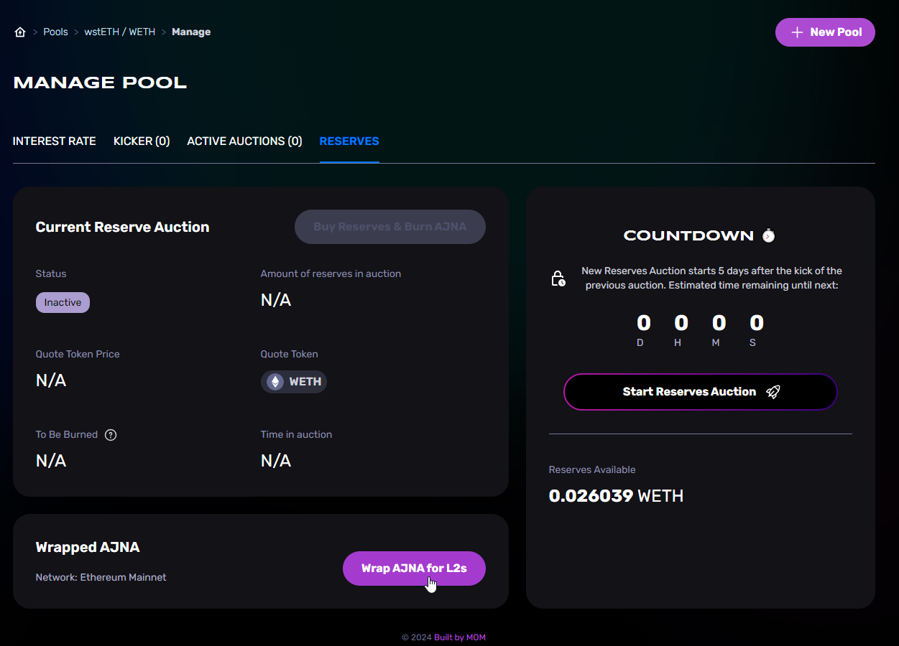

# 🚢 How to Deploy

<figure><figcaption></figcaption></figure>

### Intro

In this summary article, we cover the basics of deploying the Ajna Protocol on EVM chains of your choice. It's not as simple as pressing a couple of buttons and forgetting about it because there are considerations and requirements to be aware of.&#x20;

All of this info could be found on github, in the [Ajna-core Readme.md file](https://github.com/ajna-finance/ajna-core?tab=readme-ov-file#ajna-contracts).

### Requirements

The full details [are here](https://github.com/ajna-finance/ajna-core?tab=readme-ov-file#licensing). To summarize;\
\
Third parties may deploy The Ajna Protocol so long as:

1. No other functional and successful deployment of Ajna is available on the target chain.
2. No modification to Solidity source files in the protocol is made, and no changes are made that conflict with the [Business License](https://github.com/ajna-finance/ajna-core/blob/master/LICENSE).
3. Before deployment, the canonical burn-wrapped AJNA token (bwAJNA) on Ethereum mainnet is bridged to the target chain using the L2’s canonical bridge.  For untrusted bridges, consider double-wrapping on L1.
4. Upon deployment, the protocol is configured to use the bwAJNA token from step 3 on the target chain.

### Deploying the Contracts

The full details [are here](https://github.com/ajna-finance/ajna-core?tab=readme-ov-file#deployment). To summarize;

1. Create some [bwAJNA](https://etherscan.io/token/0x936ab482d6bd111910a42849d3a51ff80bb0a711).

Do so by going to ajnafi.com and navigating to any pool's "manage pool" section, then go to the "reserves", then interact with the "Wrap AJNA for L2s" widget on the bottom left.

<figure><figcaption></figcaption></figure>

2. [Bridge](https://l2beat.com/bridges/summary) bwAJNA to the target chain.
   * [Choose a bridge](https://faqs.ajna.finance/faqs/ajna-token#which-bridge-do-i-use-to-send-my-bwajna-to-another-network)
   * Bridge the token to the target chain.
3. Configure deployment to use the bridged bwAJNA token by setting `AJNA_TOKEN` environment variable to the L2 token address.
4. A [deployment script](https://github.com/ajna-finance/ajna-core/blob/master/script/deploy.s.sol) exists to help automate the deployment of all the libraries and contracts.  Before running, update the `Makefile` with any specific configuration for the target chain, such as  the `--verifier-url`.  You may need to create a new account and API key using the chain’s explorer GUI and set your `ETHERSCAN_API_KEY` accordingly.
5. Run the script with `make deploy`.

### Getting Integrated

#### Recommendations

These make it easier for frontends to integrate your network's Ajna Protocol instance:

1. Give UIs access to a node.
2. Consider paying UIs to integrate your network.

#### Front End Apps & Info Sites

To get your deployment listed on frontends and info sites you will need to get in contact with them. The parties are under no obligation to list new deployments. In all cases they will likely do their own verification that the deployment is done properly. Frontends may seek financial and/or infrastructure support (ETH-RPC node, subgraph deployment) for integrations. Below are some of the popular sites and contact info of their representatives.

**Front End Apps**

**Summer.fi**\
[Summer.fi/ajna\
](http://summer.fi/ajna)[https://discord.gg/summerfi\
](https://discord.gg/summerfi)Contact Lucian\
[https://t.me/Lucianken](https://t.me/Lucianken)\
\
**Builtbymom**\
[ajnafi.com\
](https://ajnafi.com/)[https://discord.gg/zp8aJBkwBY](https://discord.gg/zp8aJBkwBY) (visit the ajnaficom-support channel)\
Contact Facu\
[https://t.me/saltyfacu](https://t.me/saltyfacu)

#### Info Sites

**Block Analitica**\
[info.ajna.finance\
](https://info.ajna.finance/)[https://discord.gg/zp8aJBkwBY\
](https://discord.gg/zp8aJBkwBY)Contact\
[https://t.me/xcommanderkeen](https://t.me/xcommanderkeen)
